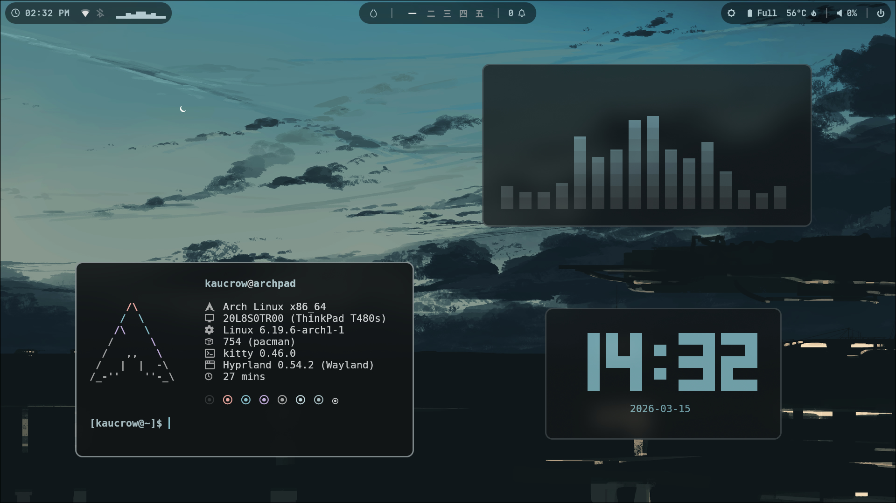
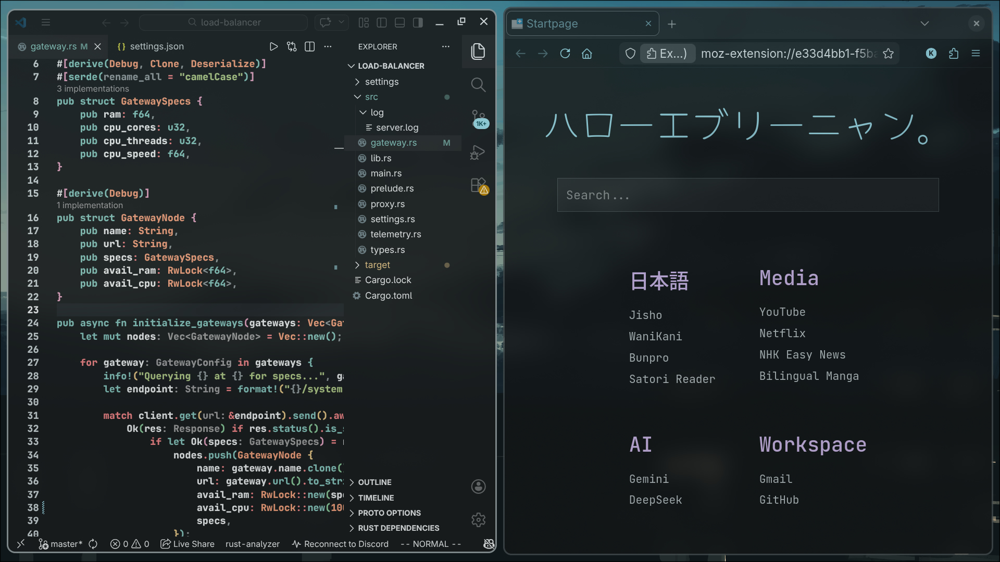
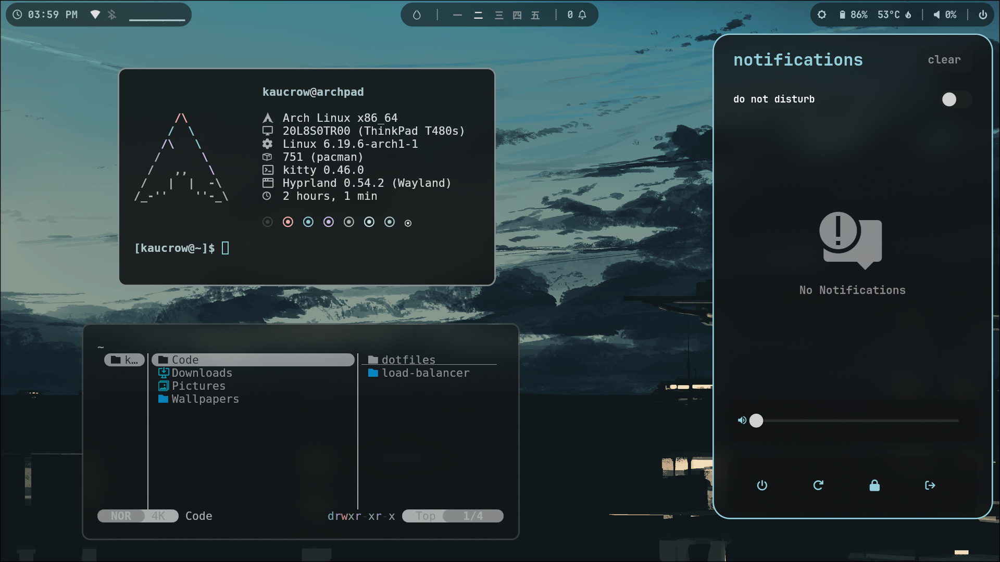
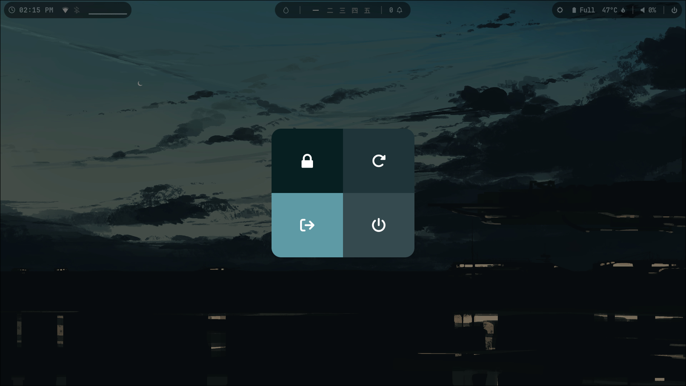
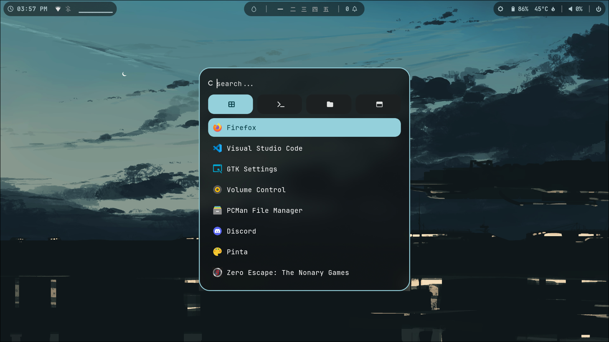

# Kaucrow's dots

Welcome to my Arch dotfiles owo

This is a Hyprland-based setup designed to be fast, minimal, and dynamic. The heart of this rice is Matugen, which handles all the color generation to make sure everything from the status bar to the terminal stays perfectly in sync with the active wallpaper.

<div align="left">
  <br>
  <a href="#packages"><kbd><br> Packages <br></kbd></a>&ensp;&ensp;
  <a href="#showcase"><kbd><br> Showcase <br></kbd></a>&ensp;&ensp;
  <a href="#installation--usage"><kbd><br> Installation <br></kbd></a>&ensp;&ensp;
  <a href="#credits"><kbd><br> Credits <br></kbd></a>
  <br>
</div>

## Packages
- WM: [hyprland](https://github.com/hyprwm/Hyprland)
- Bar: [waybar](https://github.com/Alexays/Waybar)
- Terminal emulator: [kitty](https://github.com/kovidgoyal/kitty)
- Icons: [Papirus-Dark](https://archlinux.org/packages/extra/any/papirus-icon-theme/)
- Font: [JetBrainsMono Nerd Font Propo](https://archlinux.org/packages/extra/any/ttf-jetbrains-mono-nerd/)
- Cursor: [Rose Pine Cursor](https://github.com/rose-pine/cursor)
- App launcher: [rofi](https://github.com/davatorium/rofi)
- Notifications: [swaync](https://github.com/ErikReider/SwayNotificationCenter)
- Theming: [matugen](https://github.com/InioX/matugen)
- Lockscreen: [hyprlock](https://github.com/hyprwm/hyprlock)
- Logout menu: [wlogout](https://github.com/ArtsyMacaw/wlogout)
- Display manager: [ly](https://github.com/fairyglade/ly)
- Fetch displayer: [fastfetch](https://github.com/fastfetch-cli/fastfetch)
- Audio visualizer: [cava](https://github.com/karlstav/cava)
- Clock: [tty-clock](https://github.com/xorg62/tty-clock)

## Showcase







## Installation & Usage
To get these dots running on a fresh Arch install, from a root shell with network access:

1. Clone the repo
```
git clone https://github.com/Kaucrow/dotfiles.git
```

2. Cd into the downloaded folder
```
cd dotfiles
```

3. Make the setup script executable
```
chmod +x setup.sh
```

4. Run the script and follow the setup instructions
```
./setup.sh
```

Take in mind that the script may ask you to input the user password a few times during the setup.

After the setup is complete, reboot, log into the system, and press Super + W to choose a wallpaper and complete the theming.

Feel free to reach out to me if you have any questions or suggestions :)

## Credits
Special thanks to [LierB](https://github.com/LierB) & [JaKooLit](https://github.com/JaKooLit), on whose dotfiles mine were based.